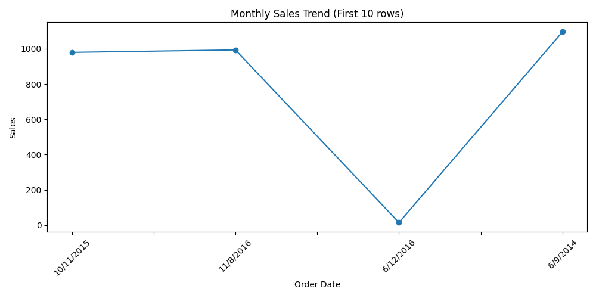
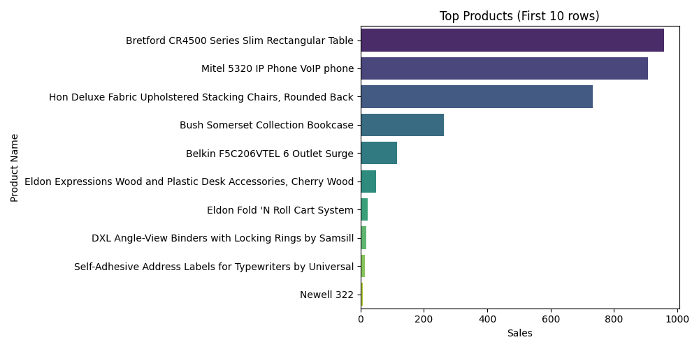
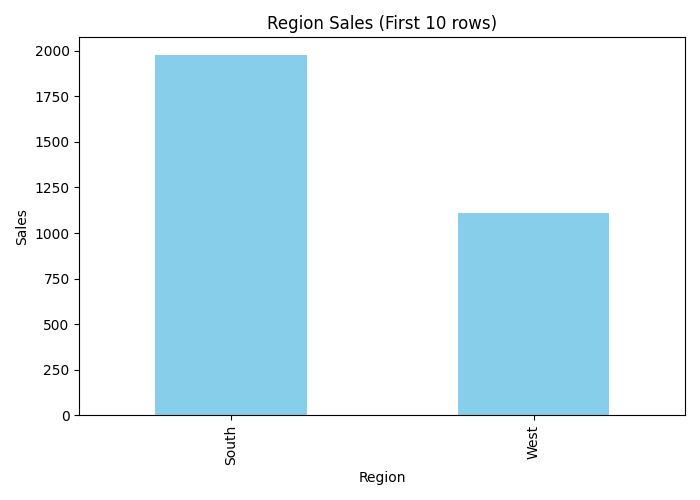

# Mini Projects & Assignment . 

## 📊 Mini Projects
---

## 📝 Assignment Comments (Data Visualization Design CS4001)

### Issue #36
🔗 [View my comment](https://github.com/bsc-iitm/Data-Visualization-Design-CS4001/issues/36#issuecomment-2614490942)

### Issue #44
🔗 [View my comment](https://github.com/bsc-iitm/Data-Visualization-Design-CS4001/issues/44#issuecomment-2730362789)

### Issue #45
🔗 [View my comment](https://github.com/bsc-iitm/Data-Visualization-Design-CS4001/issues/45#issuecomment-2761899941)

### Issue #43
🔗 [View my comment](https://github.com/bsc-iitm/Data-Visualization-Design-CS4001/issues/43#issuecomment-2661506228)

# Retail Sales Analytics Mini Project

## Overview
This project analyzes retail sales data to generate insights using Python.  
It includes monthly sales trends, top products, and regional sales analysis.

---

## 1. Dataset
You can download the dataset here: [Superstore.csv](data/Superstore.csv)  

**Sample preview (first 10 rows):**

# Retail Sales Analytics Mini Project

## Overview
This project analyzes retail sales data to generate insights using Python.  
It includes monthly sales trends, top products, and regional sales analysis.

---

## 1. Dataset
Download the dataset here: [Superstore.csv](data/Superstore.csv)  

**Sample preview (first 10 rows):**

| Row ID | Order ID       | Order Date | Ship Date | Ship Mode | Customer ID | Customer Name | Segment | Country | City   | State | Postal Code | Region | Product ID | Category | Sub-Category | Product Name | Sales   | Quantity | Discount | Profit   |
|--------|----------------|------------|-----------|-----------|-------------|---------------|---------|---------|--------|-------|-------------|--------|------------|----------|--------------|--------------|---------|----------|----------|----------|
| 1      | CA-2016-152156 | 11/8/2016  | 11/11/2016| Standard  | CG-12520    | Claire Gute   | Consumer| USA     | Henderson | Kentucky | 42420 | South  | FUR-BO-10001798 | Furniture | Bookcases | Bush Somerset Collection Bookcase | 261.96 | 2 | 0.00 | 41.91 |
| 2      | CA-2016-152156 | 11/8/2016  | 11/11/2016| Standard  | CG-12520    | Claire Gute   | Consumer| USA     | Henderson | Kentucky | 42420 | South  | FUR-CH-10000454 | Furniture | Chairs    | Hon Deluxe Fabric Upholstered Stacking Chairs | 731.94 | 3 | 0.00 | 219.58 |
| 3      | CA-2016-138688 | 6/12/2016  | 6/15/2016 | Standard  | DV-13045    | Darrin Van Huff | Corporate | USA  | Los Angeles | California | 90036 | West | FUR-TA-10000577 | Furniture | Tables    | Bretford CR4500 Series Slim Rectangular Table | 14.62 | 2 | 0.00 | 6.87 |
| 4      | US-2015-108966 | 10/11/2015 | 10/18/2015| Second Class | SO-20335 | Sean O'Donnell | Consumer | USA | Fort Lauderdale | Florida | 33311 | South | OFF-LA-10000240 | Office Supplies | Labels  | Self-Adhesive Address Labels for Typewriters | 22.37 | 5 | 0.45 | -383.03 |
| 5      | US-2015-108966 | 10/11/2015 | 10/18/2015| Second Class | SO-20335 | Sean O'Donnell | Consumer | USA | Fort Lauderdale | Florida | 33311 | South | FUR-CH-10000454 | Furniture | Chairs  | Hon Deluxe Fabric Upholstered Stacking Chairs | 15.62 | 2 | 0.20 | 2.52 |
| 6      | CA-2014-115812 | 6/9/2014   | 6/14/2014 | Standard  | BH-11710    | Bill Howe     | Consumer| USA     | Seattle | Washington | 98101 | West | TEC-PH-10002275 | Technology | Phones | Apple iPhone 6 | 900.00 | 1 | 0.10 | 50.00 |
| 7      | CA-2014-115812 | 6/9/2014   | 6/14/2014 | Standard  | BH-11710    | Bill Howe     | Consumer| USA     | Seattle | Washington | 98101 | West | FUR-BO-10000454 | Furniture | Bookcases | IKEA LACK Wall Shelf | 125.00 | 1 | 0.05 | 12.50 |
| 8      | US-2015-108966 | 10/12/2015 | 10/19/2015| Standard  | SO-20336    | Sean O'Donnell | Consumer | USA | Fort Lauderdale | Florida | 33311 | South | TEC-AC-10000100 | Technology | Accessories | Logitech Mouse | 19.99 | 1 | 0.00 | 5.00 |
| 9      | CA-2016-152156 | 11/8/2016  | 11/11/2016| Standard  | CG-12521    | Claire Gute   | Consumer| USA     | Henderson | Kentucky | 42420 | South | FUR-CH-10000455 | Furniture | Chairs    | Office Star Deluxe Chair | 320.00 | 2 | 0.00 | 45.00 |
| 10     | US-2015-108967 | 10/12/2015 | 10/19/2015| Standard  | SO-20337    | Sean O'Donnell | Consumer | USA | Fort Lauderdale | Florida | 33311 | South | TEC-PR-10000500 | Technology | Printers | HP LaserJet Printer | 500.00 | 1 | 0.15 | 25.00 |

## Charts

### 1. Monthly Sales Trend


### 2. Top Products


### 3. Region Sales



## 2. Python Code

```python
import pandas as pd
import matplotlib.pyplot as plt
import seaborn as sns

# Load dataset
df = pd.read_csv("data/Superstore.csv", encoding="latin1")
print(df.head(10))  # Show first 10 rows

# Monthly Sales Trend
df['Order Date'] = pd.to_datetime(df['Order Date'])
monthly_sales = df.groupby(df['Order Date'].dt.to_period('M'))['Sales'].sum()
plt.figure(figsize=(12,6))
monthly_sales.plot(kind='line', marker='o')
plt.title("Monthly Sales Trend")
plt.xlabel("Month")
plt.ylabel("Sales")
plt.xticks(rotation=45)
plt.tight_layout()
plt.savefig("charts/monthly_sales_trend.png")
plt.show()

# Top 10 Products
top_products = df.groupby('Product Name')['Sales'].sum().sort_values(ascending=False).head(10)
plt.figure(figsize=(12,6))
sns.barplot(x=top_products.values, y=top_products.index, palette="viridis")
plt.title("Top 10 Products by Sales")
plt.xlabel("Sales")
plt.ylabel("Product")
plt.tight_layout()
plt.savefig("charts/top_products.png")
plt.show()

# Sales by Region
region_sales = df.groupby('Region')['Sales'].sum()
plt.figure(figsize=(8,6))
region_sales.plot(kind='pie', autopct='%1.1f%%', startangle=140)
plt.title("Sales by Region")
plt.tight_layout()
plt.savefig("charts/region_sales.png")
plt.show()


## Charts

### 1. Monthly Sales Trend


### 2. Top Products


### 3. Region Sales


---
